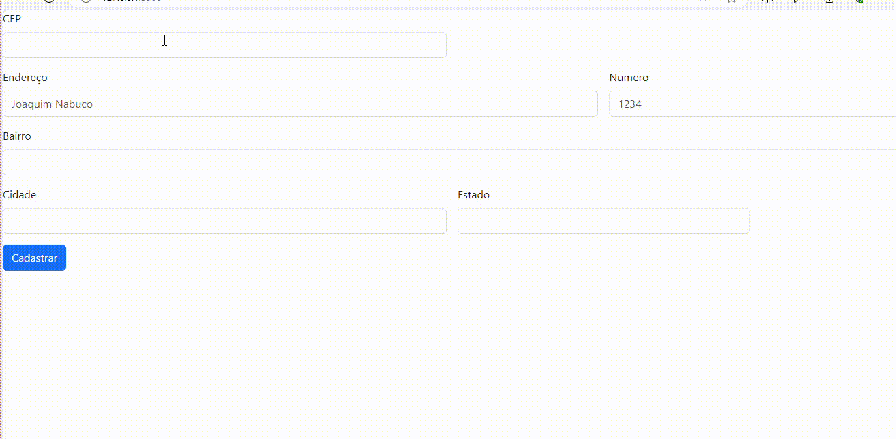

## 📝DESCRIÇÃO  
 ✍️Nesse projeto Cadendereco copiamos um codigo do bootstrap e alteramos algumas coisas como,
tradução dos campos para o português, apagando colunas que não seriam utilizadas como email e senha, colocando input e forn-control no estado, mudando o cep de lugar colancando ele para o inicio e comitando tudo para o ghithub.  
✍️No controller.js colocamos as funcinalidaes como limpar formulario que é pra apagar caso esteja errado.  
✍️O Verifica se CEP é válido que serve para confirmar o cep.  
✍️preenche campos do formulario caso nao preencheu todos os campos.  
✍️Adicionamos a  função para consumo de API utilizando a função do tipo assimcrona e nessa função colocamos um link http://viacep.com.br/ws/${cep.value}/json/` que se vc acesar ele e trocar o cep.value por o numero do cep aparece todos seus dados em ordem com plorexemplo rua, bairro, cidade E estado.  
✍️Adiciona um evento DOM, no input CEP.  

## 👩‍💻 Projeto - 
✅CORRETO
  

.gif)  
☑️ERRADO
 ## 🔧 Funcionalidades
nesse projeto ele é feito para cadastrar endereço, e com somente o CEP já consegue descobrir seus dados

 ## 🛠️ Tecnologias Utilizadas

•`HTML`
•`github`
•`README`
•`JS` 
•[`BOOTSTRAP 5`](https://getbootstrap.com/docs/5.3/forms/layout/#gutters)

 ## ✒️ Autores
•[ Amanda Vitoria ](https://github.com/amandvitoria)  

[ Emilly Caroline ](https://github.com/emillycaaroline)

 [ Larissa Manrique](https://github.com/larissassk)

 [ Leonardo Rocha ](https://github.com/LeonardoRochaMarista)

